# Data Model and Concepts

This document defines the observation graph—the data model that notarized
evaluates against policies to make trust decisions.

## Processes and Observers

A **process** has inputs and outputs.

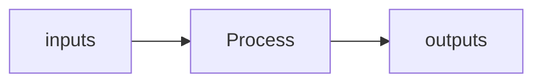

This abstraction covers computational processes (functions, services,
pipelines), business processes (approvals, audits, manufacturing), and physical
processes (assembly, shipping, verification).

When we need more trust in a process, we wrap it in an **observer**. The
observer produces **observations** about the process:

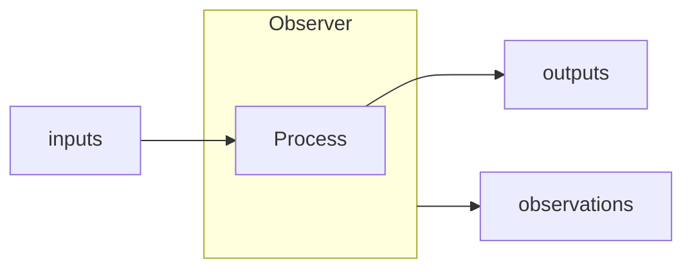

The observer doesn't change the process. It produces a parallel output—
observations—that downstream consumers use for trust decisions.

### Examples

This pattern already pervades our systems:

- **Financial Audit.** An auditor observes financial processes. The audit report
  is the observation—assertions about controls, accuracy, compliance.

- **Manufacturing Certificate of Conformance.** A manufacturer observes
  production. The certificate records materials used, tests performed,
  specifications met.

- **Code Signing.** A publisher observes their build pipeline. The signature
  observes that specific source, environment, and toolchain produced a specific
  artifact.

- **X.509 Certificates.** This example might be somewhat surprising. We often
  think of certificates as outputs of a process or credentials use for a
  process, not observations. But a certificate is the _observation_ of a
  business process—private key management. The CA observes that controls protect
  the key's scope and records those observations (subject, validity, key usage,
  policy OIDs). The process is key management. The certificate is the
  observation of the process.

### Observation Principles

For an observation to be trustworthy, the observer must meet certain criteria.
These are ideals. Real systems approximate them to varying degrees.

- **Separation.** The observer is distinct from the process—computationally,
  physically, or organizationally. _An auditor is a different organization than
  the company being audited._

- **Isolation.** The process cannot modify, disable, or influence the observer.
  Information flows one direction: process → observer. _A flight data recorder
  cannot be disabled by the pilot during flight._

- **Disinterest.** The observer has no stake in the process outcome. It cares
  only about accuracy of observation. _A notary public doesn't care what's in
  the document._

- **Scope.** Observations cannot extend beyond the observer's actual access. A
  witness testifies to what they saw—not what they heard from others.

- **Integrity.** Observations cannot be altered after production without
  detection. _Tamper-evident seals on shipping containers._

The gap between ideal and actual affects how much weight to place on an
observation.

### Observations and Properties

An observation is a structured record—a collection of **properties**. Each
property is a named value.

Consider an X.509 certificate. It has properties like `subject`, `issuer`,
`validity`, `public_key`, `extensions`:

```
certificate {
    subject: "example.com"
    issuer: "DigiCert"
    validity: { not_before: ..., not_after: ... }
    public_key: 0x...
    extensions: { ... }
}
```

An attestation report has different properties: `measurement`, `policy`,
`report_data`. A financial audit has findings, material weaknesses, opinion
type. The structure varies by domain, but the pattern holds: observations are
property collections.

Properties are the atomic unit. Trust decisions operate on properties not nodes.
In fact, nodes are just collections of properties. The observation graph is a
grouped (node) property graph.

### Constraints

A **constraint** is an assertion about properties. We call a constraint within a
single observation a **pin**. A self-signed certificate pins
`subject == issuer`. A version check pins `version >= 2.0`.

Constraints are how policies express requirements. For now, think of pins as the
basic case. Later we'll see constraints that relate observations to each other:
bonds (within a chain) and bridges (across domains).

## Observation Chains

### Delegation

An observer can delegate authority to another observer.

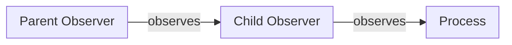

Consider a root CA. It observes the key management practices of a subordinate
CA—physical security, personnel controls, policy compliance. If satisfied, it
issues a certificate: an observation that says "this entity can act as a CA."
The subordinate is now an observer too, authorized to make its own observations.

This is a parent/child relationship. The parent observes a process (key
management, operational controls) and produces an observation that endorses the
child as an observer. The child may have existed before. It may have even
produced observations before. But trust in those observations derives from the
parent's oversight of the child.

**More examples of delegation:**

- A firmware signing key endorses a bootloader signing key.
- A TPM manufacturer CA endorses an Endorsement Key.
- An audit firm's root endorses individual auditors.
- A hardware security module endorses derived keys.

### Chains

With delegation, observers form chains.

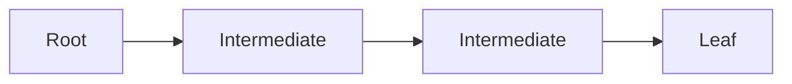

A **non-terminal observation** endorses the next observer. A **terminal
observation** ends the chain—it observes something other than another observer.

The first observer in any chain is special: it has no parent. It can only be
trusted via an explicit grant of trust. This is the leap of faith that grounds
the entire chain.

Integrity can be established in many ways: digital signatures (X.509, code
signing), credential binding (TPM MakeCredential), extend-only registers with
replay validation (PCRs + TCG event log), or physical tamper evidence. The
mechanism varies; the guarantee is the same: a parent's property (its key, its
register state) guarantees the child's entire integrity.

We call this a **link**. A link binds a parent's property to a child's complete
integrity. Links form chains.

**Example: AMD SEV-SNP attestation chain.**

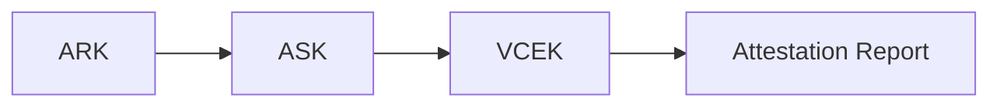

| Observer | Type         | Observes             | Produces           |
| -------- | ------------ | -------------------- | ------------------ |
| ARK      | Non-terminal | ASK's key management | ASK certificate    |
| ASK      | Non-terminal | CPU manufacturing    | VCEK certificate   |
| VCEK     | Terminal     | VM launch state      | Attestation report |

ARK is explicitly trusted (the leap of faith). Trust in ASK derives from ARK's
endorsement. Trust in VCEK derives from ASK's endorsement. Trust in the
attestation report derives from VCEK.

### Bonds

Links bind parent properties to child integrity. But within a chain, we also
need to compare properties across observations—does the child's `issuer` match
the parent's `subject`?

We call these **bonds**. A bond compares properties across observations within
the same chain.

**Example: X.509 chain validation.**

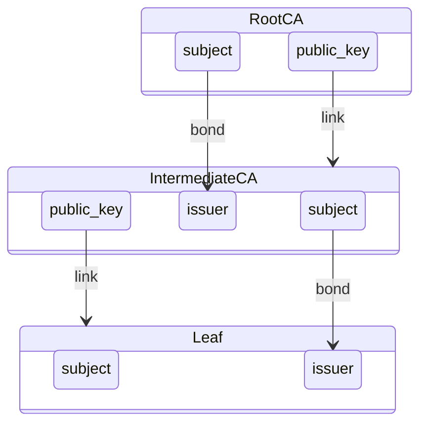

The arrows labeled "bond" compare properties (issuer must match subject). The
arrows labeled "link" show integrity guarantees (the parent's key signs the
child). Break any link or bond, validation fails.

Some properties are **critical**—they constrain what the child can legitimately
claim. ASK can only endorse VCEKs for chips it observed during manufacturing.
VCEK can only attest to VMs that match the launch policy. Other properties are
**non-critical**—informational, useful for logging or debugging, but not
enforced. Critical properties define the trust boundary; non-critical properties
describe it.

## Federation

### Observation Domains

A chain rooted at an explicitly trusted observer forms an **observation
domain**—a coherent region of trust with unified authority.

AMD's SEV-SNP chain is one domain. A WebPKI CA hierarchy is another. A TPM
manufacturer's certificate chain is a third. Each has its own root, its own
policies, its own scope.

Within a domain, chains establish hierarchy. Constraints validate linkage. Every
observation traces back to the root.

### Independent Authorities

Different authorities run different observation domains. No single root governs
them all.

- **Hardware manufacturers** run domains for device identity. AMD has ARK/ASK.
  Intel has their attestation CA. TPM manufacturers have their own CAs.

- **Software publishers** run domains for release integrity. Microsoft signs
  Windows. Mozilla signs Firefox. Each has their own signing roots.

- **Vulnerability databases** run domains for security findings. MITRE publishes
  CVEs. NIST maintains the NVD. These are observations too.

- **Enterprises** run domains for policy. Approved software versions, acceptable
  configurations, compliance requirements.

- **Auditors** run domains for assurance. SOC 2 reports, financial audits,
  security assessments.

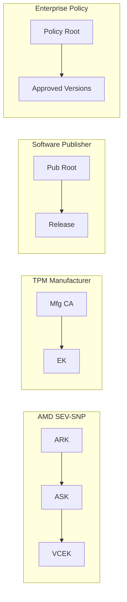

Same pattern in each: a root, a chain (or tree), observations with properties.
But no hierarchy connects them. AMD doesn't sign Microsoft's releases. Microsoft
doesn't sign AMD's chips. They're independent authorities over independent
processes.

This collection of independent domains is a **federation**.

## Cross-Domain Constraints

Domains are independent, but trust decisions often span them.

"Run this workload" requires:

- Hardware attestation (AMD SEV-SNP domain)
- Software integrity (publisher domain)
- No known vulnerabilities (CVE domain)
- Approved by policy (enterprise domain)

These come from different roots. No chain connects them. But their observations
share properties that relate:

| Domain 1             | Property      | Domain 2              | Property            |
| -------------------- | ------------- | --------------------- | ------------------- |
| Runtime attestation  | `measurement` | Software publisher    | `release.hash`      |
| Hardware attestation | `chip.id`     | Manufacturer database | `device.serial`     |
| Software release     | `version`     | CVE database          | `affected_versions` |
| Software release     | `version`     | Enterprise policy     | `approved_versions` |

When `attestation.measurement == release.hash`, the runtime is running exactly
what the publisher released. When `release.version not in cve.affected`, the
software has no known vulnerabilities.

These are cross-domain comparisons. They're like bonds, but across observation
domains instead of within a single chain.

### Bridges

We call these **bridges**. A bridge compares properties across observation
domains.

Links guarantee integrity (property-to-node). Bonds and bridges compare
properties (property-to-property). Bonds work within a chain. Bridges work
across domains.

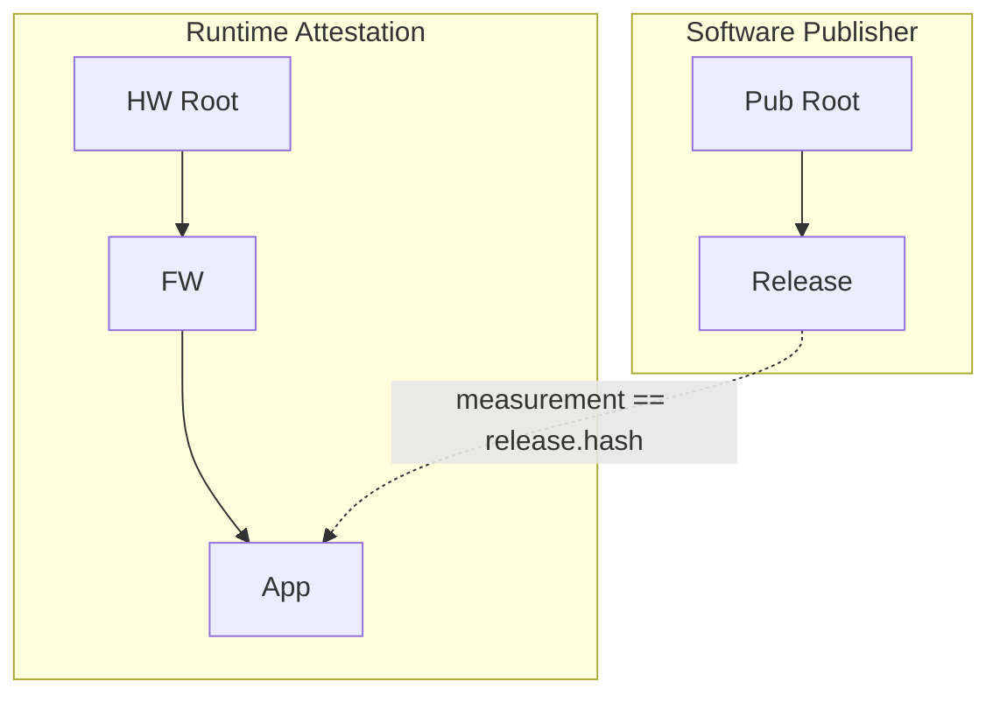

The bridge connects runtime attestation to the software publisher chain. When
the properties match, trust flows: the runtime is running exactly what the
publisher released.

Bridging doesn't require exact equality. It requires **deterministic
derivation**—some known transformation from A to B such that the relationship
can be verified. Hash equality is the simplest case. But a bridge could also
verify that a version falls within a range, that a certificate was issued before
a revocation date, or that a measurement matches any of several approved values.

**Bridge examples:**

| Domain 1             | Domain 2              | Bridge Property                       |
| -------------------- | --------------------- | ------------------------------------- |
| Runtime attestation  | Software publisher    | measurement == release.hash           |
| Runtime attestation  | CVE database          | component.version not in cve.affected |
| Hardware attestation | Manufacturer database | chip.id == device.serial              |
| Software release     | Enterprise policy     | release.version in policy.approved    |

**Example: SEV-SNP and TPM bridged via TCG event log.**

Two independent attestation chains—AMD SEV-SNP and TPM—each with their own root.
The TCG event log bridges them: the TPM quote covers a PCR digest, the event log
replays to validate that digest, and an event entry contains the SEV-SNP chip
ID. Solid arrows show integrity guarantees (signatures, credential binding,
extend-only registers). Dashed arrows show bridges (property matching).

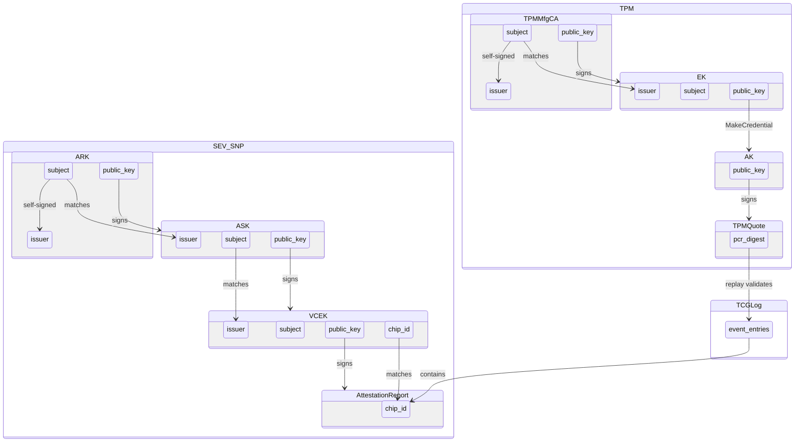

Just as delegation composes into chains, bridging composes into a federation.
Each bridge creates a path for trust to flow between domains. A trust
decision—"should I run this workload?"—can draw on observations from across the
entire federation.

## Observation Trees

Most attestations today are linear:

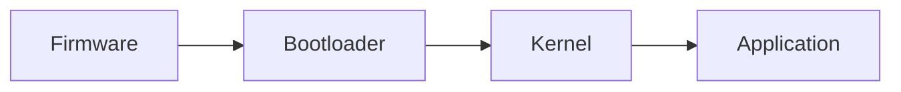

Real systems aren't linear. Components stay resident while later stages boot.
Live updates arrive without reboots. Operating systems run many processes in
parallel, each with its own isolation boundary—containers, VMs, Wasm modules, V8
isolates.

The observation graph of a real system is a tree:

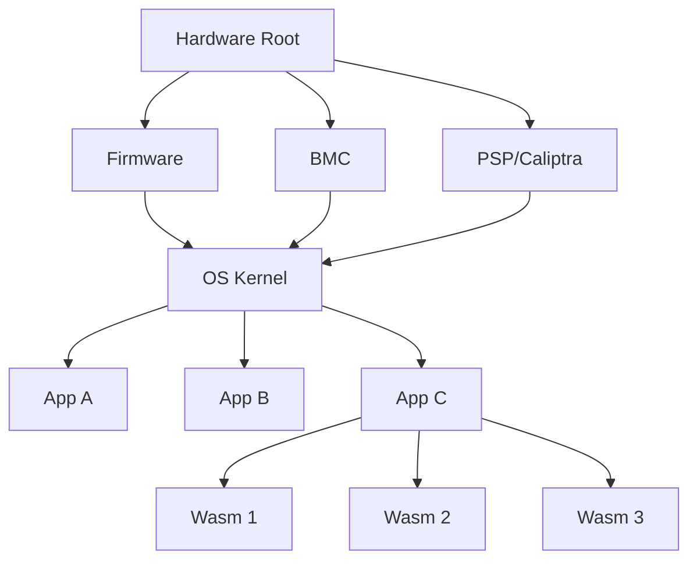

Two operations on an observation tree:

- **Inventory:** "What is the complete state of this system?" Returns the entire
  tree—every observer, every observation.

- **Identity:** "What trust path defines this specific workload?" Returns
  `root → intermediate → ... → terminal`, excluding sibling branches.

Identity allows selective disclosure. A workload can prove its trust path
without revealing what else runs on the same machine.
